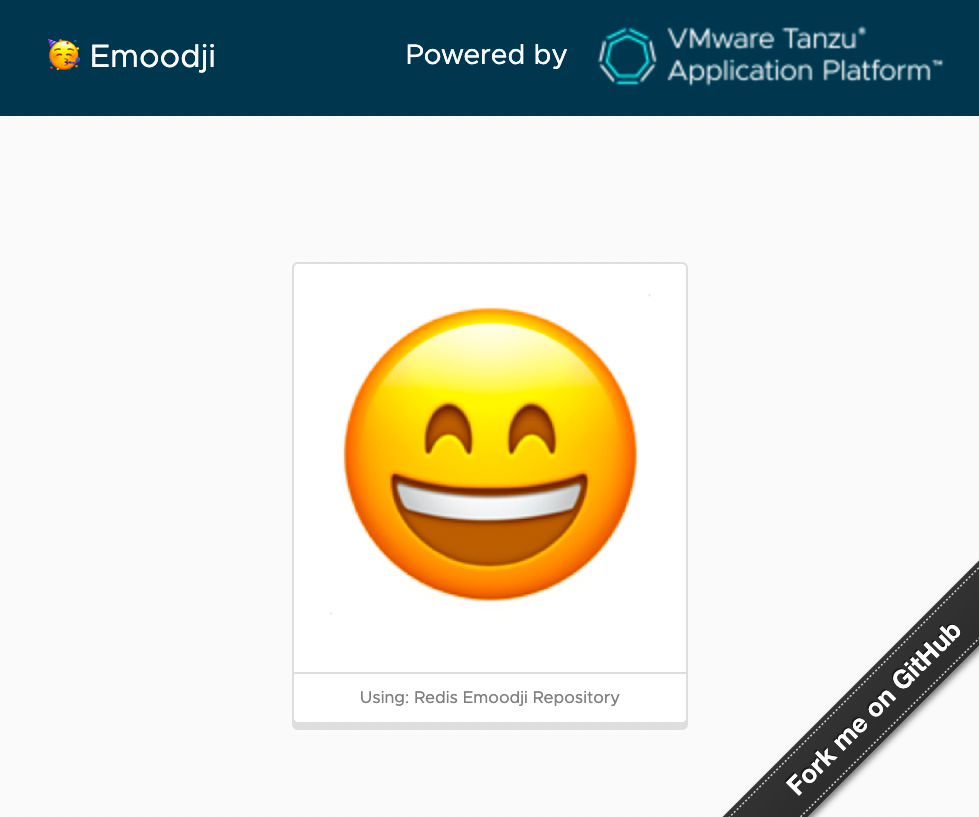

Welcome to Emoodji!

This is a simple [Spring Boot 3](https://spring.io/projects/spring-boot) app,
highligting some cool features of [Tanzu Application Platform](https://tanzu.vmware.com/application-platform),
a [VMware](https://vmware.com) product providing
the best developer experience for Kubernetes users.

In a nutshell, Emoodji is a web page with a counter.
The difference is: every time you increment the counter,
you get a new emoji face.

You have different options (databases) to persist the counter value:

- HSQLDB (in-memory only)
- PostgreSQL
- Redis

The same source code can leverage these databases.

## How to use it?

### Run on your workstation

Just run this command:

```shell
mvn spring-boot:run
```

The app is available at http://localhost:8080.

Every time you click on the emoji face, a REST request is sent to the app, incrementing a counter.
This counter is persisted using HSQLDB by default: this is an in-memory database,
which means all data is lost when you kill the Java process.

### Deploy the app to TAP

Run this command to deploy the app to your TAP developer namespace:

```shell
tanzu apps workload apply -n $TAP_NS -f config/workload.yaml
```

When no service claim is bound to the app, HSQLDB is used by default.

As a developer, you don't have to deal with the database:
just define your need as a service claim for your workload,
and let TAP bind the Kubernetes pods to the right services.

No need to worry about setting up a Kubernetes `Secret` to use service credentials, thanks to TAP!

### Switch to PostgreSQL on TAP

As a platform operator, your mission is to provide users with the best
Kubernetes developer experience. When it comes to service provionning,
you can use the best options for your users, with loose coupling
between the components.

The Emoodji app deployed by some developer requires a database. Let's see how we can provide such a database as a platform operator.

Create a PostgreSQL database instance leveraging the Bitnami Helm chart
in the TAP developer namespace:

```shell
helm repo update && \
helm upgrade emoodji-db-postgres bitnami/postgresql -n $TAP_NS --version 12.1.13 --install -f config/app-operator/postgresql-values.yaml
```

Note the password for accessing the database: `changeme`.

Along with this database instance, let's a create a binding secret:

```yaml
apiVersion: v1
kind: Secret
metadata:
  name: emoodji-db-postgres-binding
type: Opaque
stringData:
  type: postgresql
  provider: sample
  host: emoodji-db-postgres-postgresql
  database: postgres
  port: "5432"
  username: postgres
  password: changeme
```

These are the informations you need in a workload in order to connect to the database.
This feature comes from the [Service Binding](https://servicebinding.io/) project:
an industry effort to standardize access to services for Kubernetes apps.
TAP provides a default implementation for Service Binding.

Deploy this secret to the developer namespace.

Now let's create a claimable service, so that TAP workloads can use
this database:

```shell
tanzu service claim create emoodji-db-postgres-claim \
--resource-name emoodji-db-postgres-binding \
--resource-kind Secret --resource-api-version v1 -n $TAP_NS
```

You've just run the past commands as a platform operator.
Developers don't have to deal with these details.

Time to change your hat: let's pretend you're a developer now!

Deploy a new Emoodji workload, bound to the PostgreSQL database instance:

```shell
tanzu apps workload apply -n $TAP_NS -f config/workload.yaml \
--env SPRING_PROFILES_ACTIVE=postgres \
--service-ref db=services.apps.tanzu.vmware.com/v1alpha1:ResourceClaim:emoodji-db-claim \
emoodji-postgres
```

Note the use of a Spring profile to enable the configuration for PostgreSQL in the app.

The most important part in this command is the new service claim:
TAP will take care of binding your app to the right service, by automatically
injecting service credentials. As a developer, you have no idea
when this service comes from. You just want to use it for your app.

### Switch to Redis on TAP

Same idea here, but with a Redis database.

As a platform operator, let's create a Redis database instance:

```shell
helm repo update && \
helm upgrade emoodji-db-redis bitnami/redis -n $TAP_NS --version 17.4.2 --install -f config/app-operator/redis-values.yaml
```

Next, create a binding secret for Redis and deploy it to the TAP developer namespace:

```yaml
apiVersion: v1
kind: Secret
metadata:
  name: emoodji-db-redis-binding
type: Opaque
stringData:
  type: redis
  provider: sample
  host: emoodji-db-redis-master
  password: changeme
```

From now on, you can create a claimable service for Redis:

```shell
tanzu service claim create emoodji-db-redis-claim \
--resource-name emoodji-db-redis-binding \
--resource-kind Secret --resource-api-version v1 -n $TAP_NS
```

Ask your developer to create a workload bound to this Redis database:

```shell
tanzu apps workload apply -n $TAP_NS -f config/workload.yaml \
--env SPRING_PROFILES_ACTIVE=redis \
--service-ref db=services.apps.tanzu.vmware.com/v1alpha1:ResourceClaim:emoodji-db-$DB-claim \
emoodji-redis
```

You're done!

As you can see, it's easy to switch app services from a developer perspective
thanks to TAP. For example, you may want to use light databases
or ephemeral containers in development mode, and switch to a VM-based database
when going into production.

You keep the same app, just bind it to right service claim at the right time.

Hope it helps!

## Contribute

Contributions are always welcome!

Feel free to open issues & send PR.

## License

Copyright &copy; 2023 [VMware, Inc. or its affiliates](https://vmware.com).

This project is licensed under the [Apache Software License version 2.0](https://www.apache.org/licenses/LICENSE-2.0).
